# designer

《贯穿设计模式》学习笔记

持续更新!

## 博客

欢迎学习我的博客-https://blog.csdn.net/qq_41124175/category_10663389.html

### 适配器模式
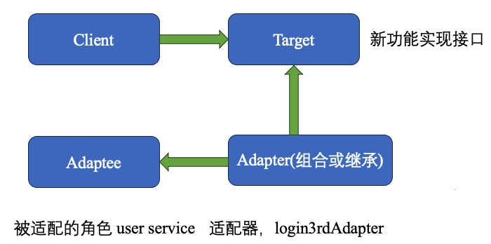

### 桥接模式

### 组合模式

### 访问者模式
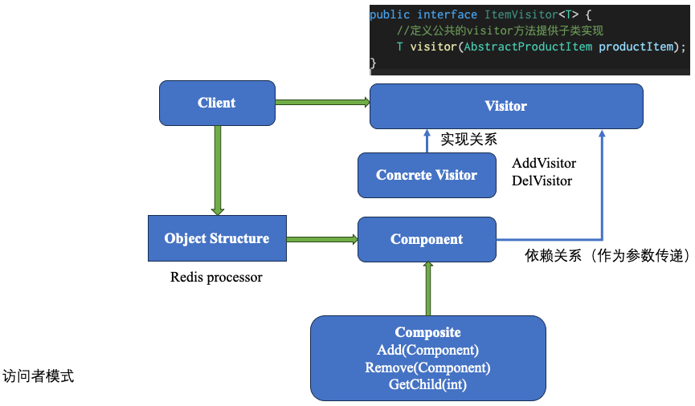

### 状态模式-有状态

### 状态模式-无状态

### 观察者模式

### 门面模式

### 策略模式

### 工厂模式
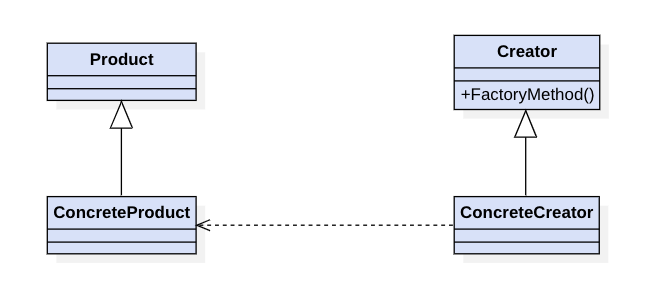

### 享元模式
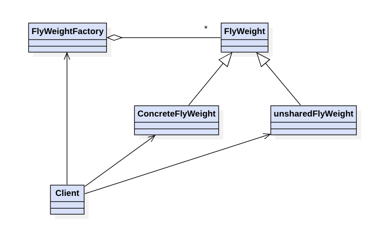

unsharedFlyWeight: 不可共享的对象（即每次使用都需要使用关键字new出来）

### 责任链模式
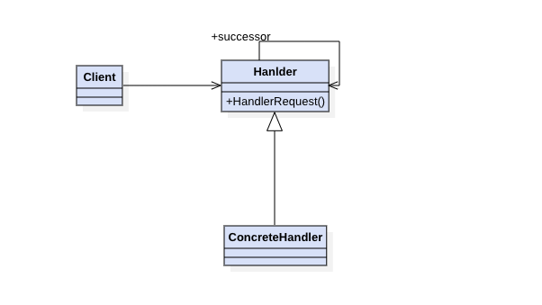 

叫责任链表比较合适

#### 需求

实时地，根据city，sex，product字段进行业务投放，比如：北京的男生；四川的电脑等等 → 责任链模式（责任链表模式）

### 装饰器模式

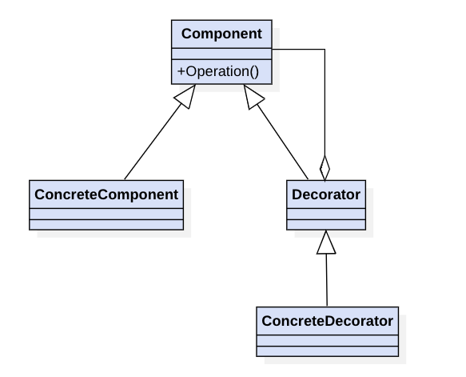

旨在不改变一个对象逻辑的前提下，为这个对象添加其他额外的职责, Decorator,组合Component又实现Component

- 在业务投放的同时，需要给用户发放红包或者积分，在不改动的投放逻辑的前提下，增加一条异步的链路 → 装饰者模式
- 新增加的异步链路对支付主链路来说是弱依赖的，在业务高峰期可以将其功能下掉或30分钟之后再进行同步。
- 功能正常/下掉/30分钟之后再同步 → Apollo配置选项提供feature开关
- 30分钟同步 → 引入MQ死信队列来解决

解决死信队列方案如下:

原理：NormalMQ Queue中没有配置消费者，发送消息设置了30分钟的最大消费时间，如果30分钟内没有被正常消费则转移到死信队列里再进行消费。

### 建造者模式

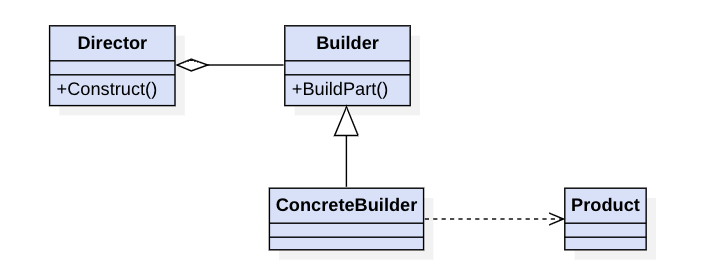
将不同的组件进行组装，最终生成一个最终的对象。与工厂模式的区别：

- 工厂模式和建造者模式都是为了建造对象；
- 工厂模式重在结果，只要能够建造对象即可；建造者模式重在构件过程，需要关心如何将不同的信息组装成一个完整的对象;

### 原型模式

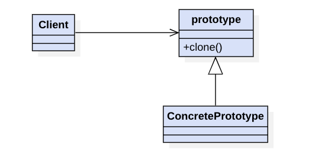

在Java语言中，比较简单，常用的两个方法如下：

- 实现Cloneable接口重写clone方法即可
- 实现Serializable序列化

需要区分一下引用拷贝，浅拷贝，深拷贝的区别。

### 代理模式

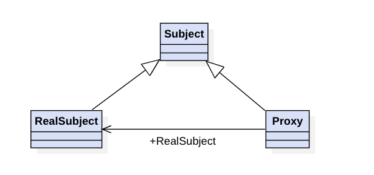

一般来对现有方法的增强。 上述是静态代理的UML图，在实战中也需要注意掌握JDK和CGLIB动态代理的原理和适用场景。

### 中介者模式

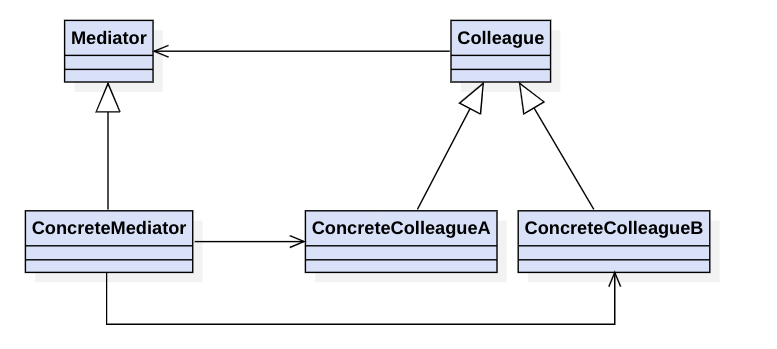

中介者模式可以通过中介者来封装一系列的对象交互，将对象间复杂的关系网状结构变成结构简单的以中介者为核心的星形结构，从而简化对象间的关系。
- Mediator：代表着中介者
- Colleague：代表着同事类（本例为购买者和支付者）

Colleague的所有操作都是对中介者的操作，所以有Colleague指向Mediator的箭头；
ConcreteMediator也持有了ConcreteColleagueA（购买者）和ConcreteColleagueB（支付者）的引用。

### 模版模式

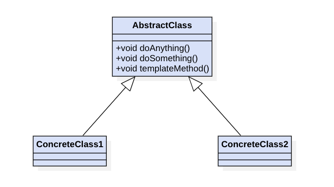

主要是AbstractClass对模版方法进行定义，ConcreteClass1-n是子类实现父类特有的方法。